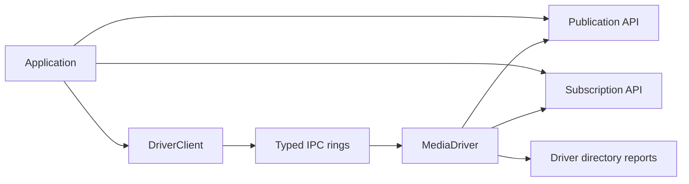
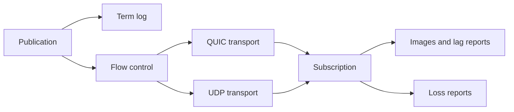
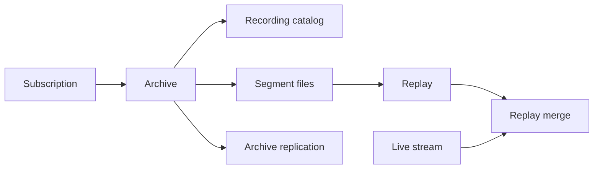
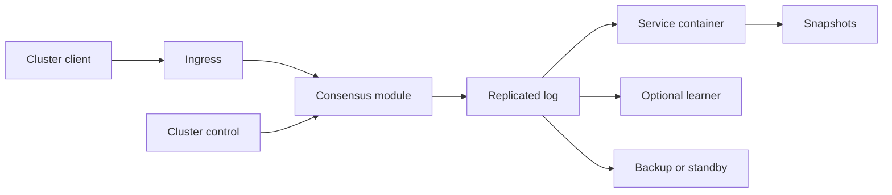
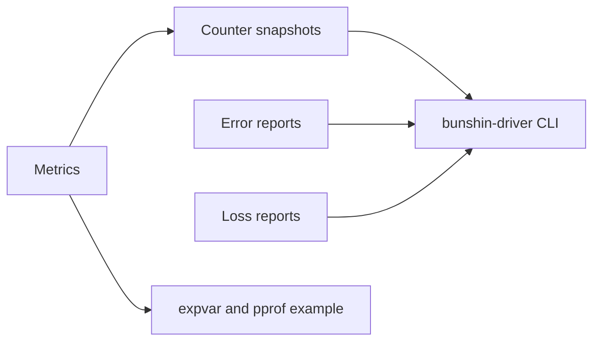

# Architecture

This document maps the current Bunshin layers. All protocols and file formats shown here are Bunshin-native.

## Client And Driver

Embedded mode uses in-process `Publication` and `Subscription` values. External mode keeps resource ownership behind the driver process and exposes operations through typed IPC commands with correlation IDs.

## Transport

QUIC is the default reliable transport. UDP is explicit and supports Bunshin-native status frames, NAK repair, multicast, multi-destination sends, dynamic destinations, local spy observations, and name re-resolution.

## Archive

The archive stores Bunshin messages and metadata in a Bunshin-native catalog and segment format. Replay merge and replication operate on those Bunshin recording descriptors.

## Cluster

Cluster support is a Bunshin-native replicated-log service container with leader election, snapshot recovery, learners, backup/standby replication, and control operations. It does not implement Aeron Cluster wire compatibility.

## Observability

The driver writes JSON report files for counters, errors, and loss. `bunshin-driver` reads those reports and can request live snapshots or report flushes through IPC.
